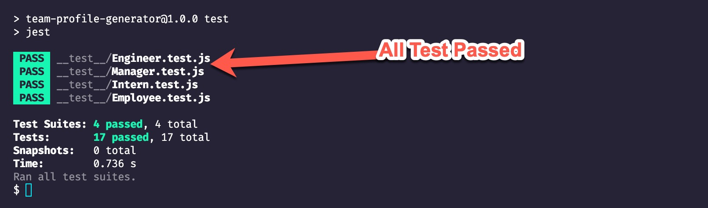
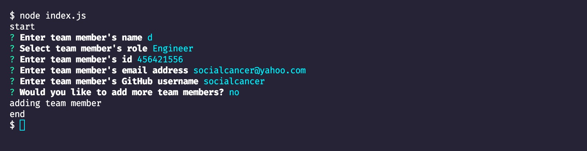

# Team Profile Generator

## Description

The Team Profile Generator is a command-line-input application that is run in Node, which requests information from the user about members of an engineering team and generates an HTML file displaying that information. Prior to running the application, the user must perform an NPM install to install all of the required dependencies.

## Installation

First, you will need Node.js on your computer. Run node --version to see if you have it installed.

Secondly, install Inquirer:

```
npm i inquirer
```

Thirdly, install Jest:

```
npm i jest
```

## Usage

This app was created using OOP concepts. In this app you will find classes and constructors which were used to create
"team member" objects based on the information added on the command line. This app uses Node.js, Jest, Inquirer, andd "FS" modules in conjunction to output a HTML file.

### Please view the screen cast of the app working here

Click here [https://drive.google.com/drive/folders/1sZgynJqjrEyDBP-L4Q3khqJwkf6Z9TdD?usp=sharing]

### Jest screenshot



### App screenshot


